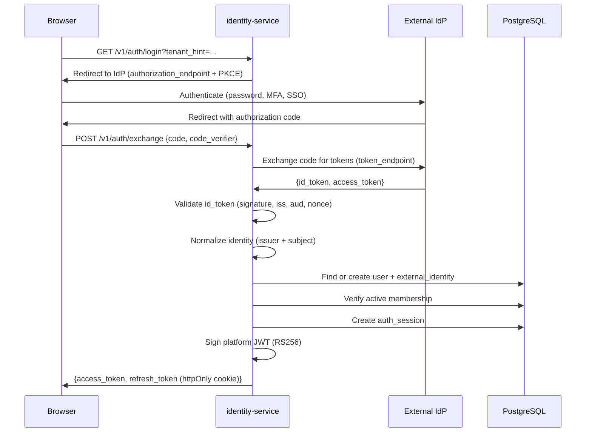
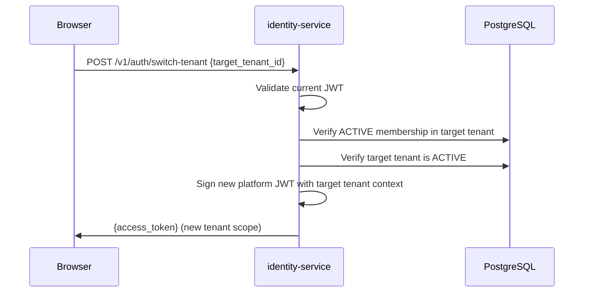
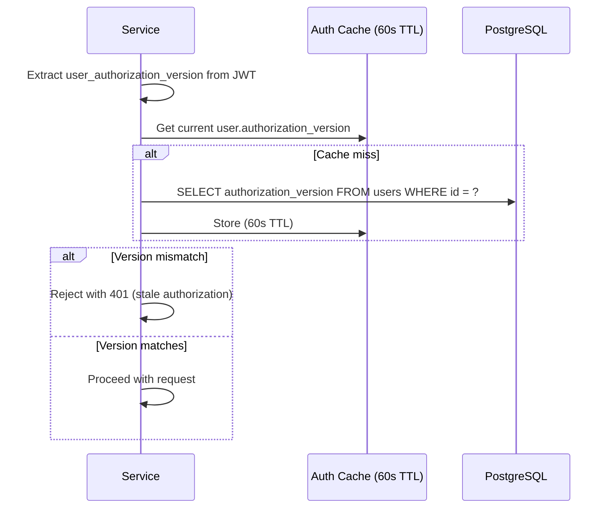
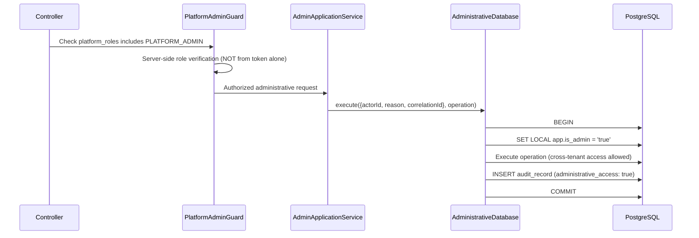

# GP-03 Identity Service — Architecture and Execution Plan

## Revision History

| Rev | Date       | Change                                                                                                                                           |
| --- | ---------- | ------------------------------------------------------------------------------------------------------------------------------------------------ |
| 1.0 | 2026-07-18 | Initial plan                                                                                                                                     |
| 2.0 | 2026-07-18 | Mandatory corrections: RLS model, OIDC boundary, identity key, stale-auth protection, demo isolation, threat model, token architecture, diagrams |
| 2.1 | 2026-07-18 | Resolve open questions; correct entity count (11); lock GP-03.0 as first checkpoint; add architecture decisions                                  |

---

## 1. Purpose

The identity-service owns authentication mapping, user identity, tenant membership, roles, permissions, session management, and provider-neutral OIDC integration.

**What it IS:**

- Identity mapping (external IdP → internal user)
- Tenant membership and authorization
- Platform token issuance (short-lived, asymmetrically signed)
- Session and refresh-token management
- JWKS endpoint for downstream verification

**What it is NOT:**

- Not a password store
- Not an MFA provider
- Not a primary identity provider
- Not a password-reset workflow
- External identity providers perform primary authentication

---

## 2. Trust Boundaries

```
┌─────────────────────────────────────────────────────────────┐
│ External Identity Provider (Auth0 / Okta / Entra ID)        │
│ Performs: primary authentication, MFA, password management  │
└─────────────────────────┬───────────────────────────────────┘
                          │ ID Token (signed by IdP)
                          ▼
┌─────────────────────────────────────────────────────────────┐
│ identity-service                                            │
│ Validates: ID token signature, issuer, audience, nonce      │
│ Maps: external identity → internal user                     │
│ Checks: membership active, user active                      │
│ Issues: platform JWT (asymmetric, short-lived)              │
└─────────────────────────┬───────────────────────────────────┘
                          │ Platform JWT
                          ▼
┌─────────────────────────────────────────────────────────────┐
│ platform-service / other services                           │
│ Validates: platform JWT via JWKS                            │
│ Extracts: tenant_id, roles, permissions, auth versions      │
│ Sets: tenant database context (NOT admin context)           │
└─────────────────────────┬───────────────────────────────────┘
                          │ Tenant-scoped transaction
                          ▼
┌─────────────────────────────────────────────────────────────┐
│ PostgreSQL with RLS                                         │
│ Enforces: tenant_id match via SET LOCAL                     │
│ Admin path: only via AdministrativeDatabase (server-side)   │
└─────────────────────────────────────────────────────────────┘
```

---

## 3. Platform-Administrator RLS Model (Corrected)

### Principle

A JWT claim NEVER directly sets `app.is_admin` in a database session. Only privileged backend code, after server-side authorization verification, may enter the administrative transaction path.

### Flow

```
Validated identity
  → Server-side lookup: does this user have PLATFORM_ADMIN assignment?
  → YES: request routed to administrative application service
  → Administrative service uses AdministrativeDatabase (not TenantAwareTransaction)
  → AdministrativeDatabase is the only code path that MAY operate without tenant RLS
  → Administrative operations are audited with admin-path indicator
```

### Rules

1. Tenant controllers and repositories NEVER use `AdministrativeDatabase`
2. Tenant-facing code ALWAYS uses `TenantAwareTransaction` which sets `app.tenant_id`
3. `app.is_admin` exists temporarily for the administrative transaction port
4. Only `AdministrativeDatabase.execute()` sets it — after backend authorization
5. No token claim, header, or request body field can trigger it
6. Cross-tenant reads/writes denied by default — return hidden 404
7. Every administrative operation produces an audit record with `administrative_access: true`

### Future Migration

Replace `app.is_admin` with a restricted PostgreSQL role (`carecareer_platform_admin`) that:

- Has SELECT on all tenant tables (read-only cross-tenant)
- Has INSERT/UPDATE only on platform-level tables (tenants, platform config)
- Does NOT have DELETE or TRUNCATE on any table
- Is assumed only for the duration of an administrative transaction
- Is never used by tenant-facing request paths

### PostgreSQL Role Model

```sql
-- Runtime role for tenant-scoped operations
carecareer_app (NOINHERIT, LOGIN)
  → SELECT, INSERT, UPDATE on tenant tables (RLS-enforced)
  → SELECT, INSERT on audit_records
  → No DELETE, TRUNCATE on audit_records

-- Administrative role for platform operations
carecareer_admin_service (NOINHERIT, LOGIN)
  → All permissions of carecareer_app
  → Can SET app.is_admin = 'true' within transactions
  → Used only by AdministrativeDatabase code path

-- Migration/maintenance role (never used at runtime)
carecareer_owner
  → Full DDL access
  → Used only for migrations
```

---

## 4. Canonical Data Model

### users

| Column                | Type         | Notes                                  |
| --------------------- | ------------ | -------------------------------------- |
| id                    | UUID         | PK                                     |
| display_name          | VARCHAR(200) |                                        |
| primary_email         | VARCHAR(320) | Profile data, NOT identity key         |
| status                | VARCHAR(30)  | ACTIVE, SUSPENDED, DEACTIVATED         |
| authorization_version | INTEGER      | Incremented on role/permission changes |
| created_at            | TIMESTAMPTZ  |                                        |
| updated_at            | TIMESTAMPTZ  |                                        |
| version               | INTEGER      | Optimistic concurrency                 |

### external_identities

| Column                | Type         | Notes                            |
| --------------------- | ------------ | -------------------------------- |
| id                    | UUID         | PK                               |
| user_id               | UUID         | FK → users                       |
| issuer                | VARCHAR(500) | OIDC issuer URL                  |
| subject               | VARCHAR(500) | OIDC sub claim                   |
| provider_type         | VARCHAR(50)  | 'entra', 'okta', 'auth0', 'mock' |
| email_claim           | VARCHAR(320) | Last known email from provider   |
| display_name_claim    | VARCHAR(200) | Last known name from provider    |
| last_authenticated_at | TIMESTAMPTZ  |                                  |
| created_at            | TIMESTAMPTZ  |                                  |

**Identity uniqueness: `UNIQUE(issuer, subject)` — NOT email.**

Multiple external identities may link to one CareCareer user.

### tenant_memberships

| Column                | Type        | Notes                                   |
| --------------------- | ----------- | --------------------------------------- |
| id                    | UUID        | PK                                      |
| user_id               | UUID        | FK → users                              |
| tenant_id             | UUID        | FK → tenants                            |
| status                | VARCHAR(30) | INVITED, ACTIVE, SUSPENDED, DEACTIVATED |
| authorization_version | INTEGER     | Incremented on role changes             |
| joined_at             | TIMESTAMPTZ |                                         |
| suspended_at          | TIMESTAMPTZ |                                         |
| deactivated_at        | TIMESTAMPTZ |                                         |
| version               | INTEGER     | Optimistic concurrency                  |
| created_at            | TIMESTAMPTZ |                                         |
| updated_at            | TIMESTAMPTZ |                                         |

**Uniqueness: `UNIQUE(user_id, tenant_id)`**

### roles

| Column      | Type         | Notes                  |
| ----------- | ------------ | ---------------------- |
| id          | UUID         | PK                     |
| name        | VARCHAR(100) | UNIQUE                 |
| scope       | VARCHAR(20)  | 'PLATFORM' or 'TENANT' |
| system      | BOOLEAN      | true = cannot delete   |
| description | TEXT         |                        |

Initial system roles:

- PLATFORM_ADMIN (platform scope)
- PLATFORM_AUDITOR (platform scope)
- TENANT_ADMIN (tenant scope)
- TENANT_OPERATOR (tenant scope)
- TENANT_AUDITOR (tenant scope)

### permissions

| Column      | Type         | Notes                        |
| ----------- | ------------ | ---------------------------- |
| id          | UUID         | PK                           |
| identifier  | VARCHAR(200) | UNIQUE, stable, dot-notation |
| scope       | VARCHAR(20)  | 'PLATFORM' or 'TENANT'       |
| description | TEXT         |                              |

### role_permissions

| Column        | Type | Notes            |
| ------------- | ---- | ---------------- |
| role_id       | UUID | FK → roles       |
| permission_id | UUID | FK → permissions |

### membership_roles

| Column        | Type | Notes                          |
| ------------- | ---- | ------------------------------ |
| membership_id | UUID | FK → tenant_memberships        |
| role_id       | UUID | FK → roles (tenant-scope only) |

### platform_role_assignments

| Column      | Type        | Notes                            |
| ----------- | ----------- | -------------------------------- |
| user_id     | UUID        | FK → users                       |
| role_id     | UUID        | FK → roles (platform-scope only) |
| assigned_by | UUID        |                                  |
| assigned_at | TIMESTAMPTZ |                                  |

---

### invitations

| Column              | Type         | Notes                               |
| ------------------- | ------------ | ----------------------------------- |
| id                  | UUID         | PK                                  |
| tenant_id           | UUID         | FK → tenants                        |
| normalized_email    | VARCHAR(320) | Lowercase, trimmed                  |
| roles               | JSONB        | Role IDs to assign on acceptance    |
| branch_ids          | JSONB        | Optional branch scope               |
| invited_by_user_id  | UUID         | FK → users                          |
| status              | VARCHAR(30)  | PENDING, ACCEPTED, EXPIRED, REVOKED |
| token_hash          | VARCHAR(128) | bcrypt or SHA-256 hash              |
| expires_at          | TIMESTAMPTZ  | Default 7 days                      |
| accepted_at         | TIMESTAMPTZ  |                                     |
| accepted_by_user_id | UUID         |                                     |
| revoked_at          | TIMESTAMPTZ  |                                     |
| version             | INTEGER      |                                     |
| created_at          | TIMESTAMPTZ  |                                     |

Invitation token rules:

- Cryptographically random (32+ bytes)
- Stored ONLY as hash
- Single use
- Expires after 7 days
- Revocable
- Never in logs, audit details, or outbox event data
- Acceptance must not reveal whether email has an account (no enumeration)

### auth_sessions

| Column               | Type         | Notes                           |
| -------------------- | ------------ | ------------------------------- |
| id                   | UUID         | PK (session ID)                 |
| user_id              | UUID         | FK → users                      |
| external_identity_id | UUID         | FK → external_identities        |
| status               | VARCHAR(30)  | ACTIVE, REVOKED                 |
| refresh_token_hash   | VARCHAR(128) | Current family token            |
| token_family         | UUID         | Rotation family                 |
| last_used_at         | TIMESTAMPTZ  |                                 |
| expires_at           | TIMESTAMPTZ  |                                 |
| client_info          | JSONB        | User-agent, IP (hashed), device |
| created_at           | TIMESTAMPTZ  |                                 |
| revoked_at           | TIMESTAMPTZ  |                                 |

Rules:

- No raw refresh tokens stored
- Token rotation: each refresh issues new token, old invalidated
- Replay detection: if old token used, entire family revoked
- Revocation is immediate — next validation rejects

### signing_keys

| Column          | Type         | Notes                     |
| --------------- | ------------ | ------------------------- |
| id              | UUID         | PK (kid)                  |
| algorithm       | VARCHAR(10)  | 'RS256' or 'ES256'        |
| public_key      | TEXT         | PEM                       |
| private_key_ref | VARCHAR(500) | Reference to secret store |
| status          | VARCHAR(20)  | ACTIVE, ROTATED, REVOKED  |
| activated_at    | TIMESTAMPTZ  |                           |
| rotated_at      | TIMESTAMPTZ  |                           |
| created_at      | TIMESTAMPTZ  |                           |

---

## 5. Token Architecture

### Signing

- **Algorithm:** RS256 (RSA 2048-bit minimum) or ES256 (P-256)
- **Private key storage:** Environment variable reference → AWS Secrets Manager in production; file-based in development
- **Public JWKS endpoint:** `GET /.well-known/jwks.json`
- **Key identifiers:** UUID `kid` in JWT header
- **Rotation:** New key activated, old key remains valid for verification during overlap period (24h)
- **Overlap:** Verification accepts current + previous key; issuance uses only current key

### Token Lifetimes

| Token                 | Lifetime                 | Storage                                        |
| --------------------- | ------------------------ | ---------------------------------------------- |
| Access (platform JWT) | 15 minutes               | Memory only (client)                           |
| Refresh               | 7 days                   | httpOnly cookie (web), secure storage (mobile) |
| Session               | 7 days (matches refresh) | Database                                       |

### Clock Skew

- Accept tokens with `iat` up to 30 seconds in the future
- Reject tokens with `exp` more than 30 seconds in the past

### Revocation

- Access tokens: not revocable (short-lived, authorization-version check provides fast invalidation)
- Refresh tokens: revocable via session revocation
- Sessions: revocable immediately (next refresh/validation rejected)

### Platform JWT Claims (Internal)

```json
{
  "iss": "carecareer-identity",
  "aud": "carecareer-api",
  "sub": "<user-id>",
  "exp": 1700000900,
  "iat": 1700000000,
  "jti": "<unique-token-id>",
  "active_tenant_id": "<tenant-uuid>",
  "membership_id": "<membership-uuid>",
  "user_authorization_version": 3,
  "membership_authorization_version": 2,
  "platform_roles": ["PLATFORM_ADMIN"],
  "tenant_roles": ["TENANT_ADMIN"],
  "permissions": ["platform.tenants.read", "platform.tenants.create"],
  "sid": "<session-id>"
}
```

No PII beyond user ID. No email, name, or sensitive data in tokens.

---

## 6. Stale-Authorization Protection

### Problem

After membership suspension, role removal, or user deactivation, a previously valid JWT must not grant continued access.

### Solution: Authorization Versions + Short Tokens + Live Check

1. **Short access tokens (15 min)** limit exposure window
2. **`user_authorization_version`** in token — incremented on any user-level change (suspend, deactivate, role add/remove)
3. **`membership_authorization_version`** in token — incremented on membership-level change (suspend, role change)
4. **Live check on sensitive operations:** services MAY cache authorization state with TTL ≤ 60 seconds
5. **Refresh rejection:** refresh-token exchange checks current versions; rejects if stale
6. **Explicit revocation:** session revocation prevents any further refresh

### Enforcement Flow

```
Request arrives with platform JWT
  → Verify signature (JWKS)
  → Check exp (reject expired)
  → Extract user_authorization_version from token
  → Compare against cached/live user.authorization_version
  → If stale: reject with 401 (force re-authentication)
  → Extract membership_authorization_version
  → Compare against cached/live membership.authorization_version
  → If stale: reject with 401
  → Proceed with normal authorization
```

### What Triggers Version Increments

| Event                       | user_authorization_version | membership_authorization_version |
| --------------------------- | -------------------------- | -------------------------------- |
| User suspended              | +1                         | —                                |
| User deactivated            | +1                         | —                                |
| Platform role added/removed | +1                         | —                                |
| Membership suspended        | —                          | +1                               |
| Membership deactivated      | —                          | +1                               |
| Tenant role added/removed   | —                          | +1                               |
| Tenant deactivated          | —                          | +1 (all memberships)             |

---

## 7. Provider-Neutral OIDC Integration

### Abstraction

```typescript
interface OidcProvider {
  getAuthorizationUrl(state: string, nonce: string, redirectUri: string): string;
  exchangeCode(code: string, redirectUri: string): Promise<OidcTokenSet>;
  validateIdToken(idToken: string, nonce: string): Promise<NormalizedIdentity>;
  getJwksUri(): string;
}

interface NormalizedIdentity {
  issuer: string;
  subject: string;
  email?: string;
  emailVerified?: boolean;
  displayName?: string;
  groups?: string[];
  authenticationTime: Date;
  rawClaims: Record<string, unknown>; // for audit, not for authorization
}
```

### Supported Providers

| Provider      | Configuration               | Notes                     |
| ------------- | --------------------------- | ------------------------- |
| Auth0         | OIDC discovery URL          | Standard OIDC             |
| Okta          | OIDC discovery URL          | Standard OIDC             |
| Entra ID      | OIDC discovery URL + tenant | Microsoft-specific claims |
| Mock (dev/CI) | Local oauth2-mock-server    | Used in tests             |

### Production Requirements

- OIDC configuration required (issuer, client_id, client_secret)
- Mock provider prohibited
- Demo authentication prohibited
- Issuer allowlist enforced
- Audience validation enforced
- Nonce and state validation enforced
- PKCE used for public clients (SPA, mobile)

### Provider Claims → CareCareer Roles

Provider-specific groups or roles may be used for initial mapping suggestions but are NOT the permanent authorization model. CareCareer memberships and roles remain authoritative. Changes to provider groups do not automatically change CareCareer permissions.

---

## 8. Demo Authentication Isolation

### Configuration Matrix (Extended from GP-02)

```
NODE_ENV=production
  → OIDC required (issuer, audience, client_id, client_secret)
  → Demo token endpoint: UNAVAILABLE (404)
  → Mock OIDC: PROHIBITED
  → DEMO_MODE flag: REJECTED at startup

NODE_ENV=development + DEMO_MODE=true
  → Mock OIDC: available (oauth2-mock-server)
  → Demo token endpoint: available (issues real platform JWTs via mock identity)
  → Seeded users with real memberships and roles
  → DEMO_AUTH_SECRET required (32+ chars)

NODE_ENV=development + DEMO_MODE=false
  → Real OIDC if configured; otherwise service starts without auth
  → Demo token endpoint: unavailable

NODE_ENV=test
  → Explicit test identity provider (in-process mock)
  → No external network calls for auth
```

### Demo Persona → Real Identity Mapping

| Demo Persona            | Seeded User                           | Membership          | Roles            |
| ----------------------- | ------------------------------------- | ------------------- | ---------------- |
| Platform Administrator  | user: platform-admin@carecareer.local | N/A (platform role) | PLATFORM_ADMIN   |
| MAS Tenant Admin        | user: mas-admin@carecareer.local      | MAS tenant, ACTIVE  | TENANT_ADMIN     |
| CareShield Tenant Admin | user: cs-admin@carecareer.local       | CareShield, ACTIVE  | TENANT_ADMIN     |
| Read-Only Auditor       | user: auditor@carecareer.local        | Platform role       | PLATFORM_AUDITOR |

The demo token endpoint:

1. Receives persona selection
2. Looks up the seeded user
3. Verifies membership is ACTIVE
4. Issues a real platform JWT with correct claims
5. Same token validation path as OIDC-authenticated users

---

## 9. Mandatory APIs

### Public (no auth)

| Method | Path                            | Purpose                               |
| ------ | ------------------------------- | ------------------------------------- |
| GET    | `/.well-known/jwks.json`        | Public signing keys                   |
| POST   | `/v1/auth/exchange`             | Exchange OIDC code for platform token |
| POST   | `/v1/auth/refresh`              | Refresh access token                  |
| POST   | `/v1/auth/logout`               | Revoke session                        |
| POST   | `/v1/auth/demo/token`           | Demo persona (dev only)               |
| POST   | `/v1/invitations/:token/accept` | Accept invitation                     |

### Authenticated

| Method | Path                                 | Permission            | Purpose                      |
| ------ | ------------------------------------ | --------------------- | ---------------------------- |
| GET    | `/v1/auth/me`                        | (any authenticated)   | Current user + active tenant |
| POST   | `/v1/auth/switch-tenant`             | (any authenticated)   | Switch active tenant         |
| GET    | `/v1/tenants/:id/members`            | tenant.members.read   | List members                 |
| POST   | `/v1/tenants/:id/invitations`        | tenant.members.invite | Create invitation            |
| GET    | `/v1/tenants/:id/invitations`        | tenant.members.read   | List invitations             |
| DELETE | `/v1/tenants/:id/invitations/:id`    | tenant.members.invite | Revoke invitation            |
| PATCH  | `/v1/tenants/:id/members/:id/status` | tenant.members.manage | Suspend/reactivate           |
| PUT    | `/v1/tenants/:id/members/:id/roles`  | tenant.roles.assign   | Update roles                 |
| GET    | `/v1/tenants/:id/roles`              | tenant.members.read   | Available roles              |
| GET    | `/v1/permissions`                    | (any authenticated)   | Permission catalog           |

### Platform Admin Only

| Method | Path                                 | Permission            | Purpose            |
| ------ | ------------------------------------ | --------------------- | ------------------ |
| GET    | `/v1/platform/users`                 | platform.users.read   | List all users     |
| GET    | `/v1/platform/users/:id`             | platform.users.read   | User detail        |
| PATCH  | `/v1/platform/users/:id/status`      | platform.users.manage | Suspend/deactivate |
| GET    | `/v1/platform/users/:id/memberships` | platform.users.read   | User's memberships |

### switch-tenant Requirements

1. Verify user has ACTIVE membership in target tenant
2. Reject if membership is SUSPENDED or DEACTIVATED
3. Reject if tenant is SUSPENDED or DEACTIVATED
4. Issue new platform JWT with updated tenant context
5. Never accept arbitrary tenant ID without membership validation
6. Audit the tenant switch

---

## 10. Role-Permission Matrix

### Platform Permissions

| Permission                 | PLATFORM_ADMIN | PLATFORM_AUDITOR |
| -------------------------- | :------------: | :--------------: |
| platform.tenants.read      |       ✓        |        ✓         |
| platform.tenants.create    |       ✓        |                  |
| platform.tenants.lifecycle |       ✓        |                  |
| platform.users.read        |       ✓        |        ✓         |
| platform.users.manage      |       ✓        |                  |
| platform.audit.read        |       ✓        |        ✓         |

### Tenant Permissions

| Permission                  | TENANT_ADMIN | TENANT_OPERATOR | TENANT_AUDITOR |
| --------------------------- | :----------: | :-------------: | :------------: |
| tenant.members.read         |      ✓       |        ✓        |       ✓        |
| tenant.members.invite       |      ✓       |                 |                |
| tenant.members.manage       |      ✓       |                 |                |
| tenant.roles.assign         |      ✓       |                 |                |
| tenant.organizations.read   |      ✓       |        ✓        |       ✓        |
| tenant.organizations.manage |      ✓       |        ✓        |                |
| tenant.entitlements.read    |      ✓       |        ✓        |       ✓        |
| tenant.entitlements.manage  |      ✓       |                 |                |
| tenant.features.read        |      ✓       |        ✓        |       ✓        |
| tenant.features.manage      |      ✓       |        ✓        |                |
| tenant.audit.read           |      ✓       |                 |       ✓        |

---

## 11. Transactional Outbox and Audit Events

### Domain Events

```
identity.user.created
identity.user.suspended
identity.user.deactivated
identity.external-identity.linked
identity.membership.created
identity.membership.activated
identity.membership.suspended
identity.membership.deactivated
identity.role.assigned
identity.role.removed
identity.invitation.created
identity.invitation.accepted
identity.invitation.expired
identity.invitation.revoked
identity.session.created
identity.session.revoked
identity.signing-key.rotated
```

### Audit Record Requirements

Every identity operation produces an audit record containing:

- Actor (who performed the action)
- Target user (affected user)
- Tenant (when applicable)
- Action identifier
- Before/after summary
- Reason (when provided)
- Correlation ID
- Session ID
- Administrative-path indicator (true if admin bypass used)

**Never in audit or events:** tokens, secrets, password hashes, invitation tokens, raw provider claims containing sensitive data.

---

## 12. Diagrams

### OIDC Login and Platform Token Exchange



### Tenant Switch



### Stale Authorization Rejection



### Platform-Admin Administrative Path



---

## 13. GP-03.0 — Threat Model

### Required Before Implementation

| Threat                               | Attack Path                         | Preventive Control                                             | Detective Control                      | Proving Test                                        | Residual Risk                         |
| ------------------------------------ | ----------------------------------- | -------------------------------------------------------------- | -------------------------------------- | --------------------------------------------------- | ------------------------------------- |
| Platform-admin privilege escalation  | Craft JWT with platform_roles claim | Server-side role lookup; token claim alone insufficient        | Audit log shows admin path usage       | Test: token with fake platform_roles rejected       | Token theft during 15-min window      |
| Cross-tenant data access             | Manipulate tenant_id in request     | RLS enforced; path param used for context; membership verified | Audit + RLS policy violation logs      | Test: cross-tenant URL returns 404                  | Admin path intentional misuse         |
| Stale authorization after suspension | Use old valid JWT                   | Authorization-version check; 15-min max exposure               | Audit shows rejected stale tokens      | Test: suspended membership token rejected           | Up to 60s cache window                |
| Token theft/replay                   | Steal JWT from client               | Short lifetime (15m); httpOnly refresh; HTTPS only             | Session tracking; unusual IP detection | Test: expired token rejected                        | Active session within 15-min window   |
| Signing-key compromise               | Extract private key                 | Key in secret store; rotation capability; revocation           | Key usage monitoring                   | Test: revoked key rejected                          | Time between compromise and detection |
| Invitation abuse (enumeration)       | Probe invitation acceptance         | No indication of email existence; rate limiting                | Failed attempt logging                 | Test: accept with invalid token gives generic error | Brute-force within rate limit         |
| Account enumeration via login        | Try different emails                | OIDC handles login (no direct email check)                     | Rate limiting on exchange endpoint     | N/A (delegated to IdP)                              | IdP-level protection                  |
| Demo auth leakage to production      | DEMO_MODE in production             | Config validation rejects DEMO_MODE in production              | Startup crash with clear error         | Test: production + DEMO_MODE = startup failure      | Misconfigured deployment              |
| Audit tampering                      | Modify audit records                | REVOKE UPDATE/DELETE on audit table for runtime role           | Immutability tests                     | Test: UPDATE/DELETE on audit_records fails          | Database admin access                 |
| Database privilege escalation        | Runtime role gains admin            | NOINHERIT roles; minimal grants; no BYPASSRLS                  | Role permission auditing               | Test: app role cannot SET app.is_admin              | PostgreSQL misconfiguration           |
| Refresh-token replay                 | Reuse old refresh token             | Token rotation; family revocation on replay                    | Session revocation logged              | Test: old refresh token revokes family              | Race condition window                 |
| Disabled-user continued access       | Suspended user keeps working        | Authorization-version + short tokens + refresh rejection       | Audit of rejected requests             | Test: suspended user refresh fails                  | 15-min access token window            |
| Membership revocation bypass         | Revoked member keeps token          | Membership version in token; live check on sensitive ops       | Audit trail                            | Test: revoked membership token rejected on refresh  | Up to 60s for cached check            |

---

## 14. Execution Slices

### GP-03.0 — Architecture Freeze and Threat Model

- Finalize this specification
- Review threat model with stakeholders
- Confirm schema, token strategy, RLS model
- No code until reviewed

### GP-03.1 — Service Skeleton and Identity Schema

- Create `services/identity-service`
- Migrations: users, external_identities, signing_keys tables
- Database roles and grants
- RLS policies on identity tables
- User domain entity with create/lookup
- Health and readiness endpoints
- OpenAPI foundation
- Audit and outbox foundation
- Unit + integration tests

Exit: service starts, user CRUD proven, RLS isolation proven

### GP-03.2 — Memberships, Roles, and Permissions

- Migrations: tenant_memberships, roles, permissions, role_permissions, membership_roles, platform_role_assignments
- Membership lifecycle state machine
- System roles seeded
- Permission derivation from role assignments
- Authorization-version increment logic
- Tenant and platform administration paths (separate services)
- Unit + integration + HTTP tests

Exit: membership lifecycle proven, role assignment proven, cross-tenant denied

### GP-03.3 — Platform Tokens and Sessions

- Migrations: auth_sessions
- Asymmetric key generation and JWKS endpoint
- Token exchange (issue platform JWT after identity validation)
- Refresh-token rotation
- Session creation and revocation
- Tenant switching
- `/v1/auth/me` endpoint
- Authorization-version enforcement on refresh
- Unit + integration + HTTP tests

Exit: token exchange works, JWKS serves keys, refresh rotates, stale versions rejected

### GP-03.4 — OIDC Provider Integration

- Provider-neutral adapter (interface + implementations)
- Mock OIDC server for dev/CI (oauth2-mock-server)
- Entra/Okta/Auth0 configuration support
- Identity linking (first login creates user + external_identity)
- Issuer and audience validation
- Nonce and state validation
- PKCE support
- Integration tests against mock provider

Exit: full OIDC flow proven against mock, identity linking proven

### GP-03.5 — Invitations

- Migrations: invitations table
- Invitation creation with hashed token
- Invitation acceptance flow
- Expiry and revocation
- Outbox event for email delivery (adapter pattern)
- Mock delivery adapter for local/CI
- Unit + integration + HTTP tests

Exit: invite → accept → membership creation proven, expired/revoked rejected

### GP-03.6 — Administration Console

- Login page (OIDC redirect or demo persona)
- Current user display
- Tenant selector (for multi-tenant users)
- Member list
- Invite member form
- Suspend/reactivate membership
- Assign/remove roles
- Permission-aware UI controls
- Session/logout behavior
- Chromium E2E tests

Exit: full identity UI flow in Chromium, demo:verify passes

### GP-03.7 — Demo Migration

- Seeded users with external_identities
- Seeded memberships with roles
- Demo token endpoint issues real platform JWTs
- Production startup rejects demo config
- All DEMO-01 Chromium flows remain green
- demo:verify passes end-to-end

Exit: demo personas use real identity model, production rejects demo, all gates pass

---

## 15. Acceptance Tests

### Mandatory Tests (per specification requirements)

| #   | Test                                                                | Slice   |
| --- | ------------------------------------------------------------------- | ------- |
| 1   | Same issuer + subject maps to one user                              | GP-03.4 |
| 2   | Same email from different issuers is NOT automatically one identity | GP-03.4 |
| 3   | External identity can be explicitly linked                          | GP-03.4 |
| 4   | Suspended user cannot exchange or refresh tokens                    | GP-03.3 |
| 5   | Suspended membership cannot switch into tenant                      | GP-03.3 |
| 6   | Deactivated membership is terminal                                  | GP-03.2 |
| 7   | User cannot assign role with permissions they cannot administer     | GP-03.2 |
| 8   | Tenant admin cannot assign platform roles                           | GP-03.2 |
| 9   | Cross-tenant membership read returns hidden 404                     | GP-03.2 |
| 10  | Platform admin access uses explicit administrative path             | GP-03.2 |
| 11  | Platform-admin claim alone cannot activate database admin context   | GP-03.2 |
| 12  | Invitation token is single use                                      | GP-03.5 |
| 13  | Expired invitation rejected                                         | GP-03.5 |
| 14  | Revoked invitation rejected                                         | GP-03.5 |
| 15  | Invitation acceptance is idempotent                                 | GP-03.5 |
| 16  | Old access token rejected after authorization-version change        | GP-03.3 |
| 17  | Revoked session cannot refresh                                      | GP-03.3 |
| 18  | Refresh-token replay revokes token family                           | GP-03.3 |
| 19  | Mock OIDC cannot start in production                                | GP-03.4 |
| 20  | Demo authentication cannot start in production                      | GP-03.7 |
| 21  | Signing-key rotation accepts current and overlap keys               | GP-03.3 |
| 22  | Unknown signing key is rejected                                     | GP-03.3 |
| 23  | Incorrect issuer or audience is rejected                            | GP-03.3 |
| 24  | No secrets or tokens in logs, audit, or outbox                      | GP-03.1 |
| 25  | Real PostgreSQL RLS prevents cross-tenant CRUD                      | GP-03.2 |
| 26  | DEMO-01 Chromium flow remains green after migration                 | GP-03.7 |

### Per-Slice Exit Gate

Every slice must pass:

- `pnpm lint`
- `pnpm format:check`
- `pnpm typecheck`
- `pnpm test` (unit)
- HTTP contract tests
- PostgreSQL integration tests
- `pnpm build`
- Docker verification
- OpenAPI validation
- Security-specific tests for that slice
- Execution-status update
- Clean working tree
- Focused commit

GP-03.6 and GP-03.7 additionally require Chromium E2E tests.

### Final Tag

```
gp-03-identity-service-final
```

Created only after ALL slices pass and demo migration is complete.

---

## 16. Dependencies

| Dependency           | Source   | Notes                                             |
| -------------------- | -------- | ------------------------------------------------- |
| @carecareer/auth     | Extend   | Add OIDC provider abstraction, JWKS verification  |
| @carecareer/database | Reuse    | TenantAwareTransaction, AdministrativeDatabase    |
| @carecareer/events   | Reuse    | OutboxWriter for identity events                  |
| @carecareer/config   | Extend   | Add OIDC provider config, signing key config      |
| platform-service     | Consumer | Validates platform JWTs via JWKS (no code change) |
| oauth2-mock-server   | Dev dep  | Mock OIDC provider for local/CI                   |
| jose                 | Dep      | JWT signing, JWKS generation, key management      |

---

## 17. Risks

| Risk                                           | Impact | Likelihood | Mitigation                                                 |
| ---------------------------------------------- | ------ | ---------- | ---------------------------------------------------------- |
| OIDC provider lock-in                          | High   | Medium     | Provider-neutral abstraction; claim mapping configurable   |
| Multi-tenant JWT complexity                    | Medium | High       | Single active tenant; explicit switch; clear documentation |
| Invitation email delivery                      | Low    | Medium     | Outbox event + adapter; delivery is replaceable            |
| Migration conflict with existing tenants table | Medium | Low        | identity-service REFERENCES tenants, does not own it       |
| Demo-mode regression                           | High   | Medium     | demo:verify must pass at every slice boundary              |
| Key rotation during active sessions            | Medium | Low        | Overlap period; verify with current + previous key         |
| Authorization-version cache staleness          | Low    | Medium     | Max 60s TTL; sensitive operations do live check            |

---

## 18. Resolved Architecture Decisions

All open questions have been resolved. These are binding for GP-03 implementation.

### ADR-1: Signing Algorithm

**Decision:** RS256 for GP-03.

**Rationale:**

- Broad compatibility with enterprise identity and gateway tooling
- Straightforward JWKS support
- Familiar operational model
- Easier integration with existing OIDC ecosystems

**Requirements:**

- Implementation must be algorithm-agile (ES256 evaluable later without changing consumers)
- Include `kid` in all tokens
- Publish active and overlap keys through JWKS
- Reject unsupported algorithms
- Never accept `alg=none`
- Never select verification algorithm solely from untrusted token header

### ADR-2: Custom Roles

**Decision:** Deferred. GP-03 supports only system roles.

System roles: PLATFORM_ADMIN, PLATFORM_AUDITOR, TENANT_ADMIN, TENANT_OPERATOR, TENANT_AUDITOR

Schema includes `role_type = SYSTEM | CUSTOM` for future extensibility, but CUSTOM role creation/modification remains disabled until a future milestone. No custom-role APIs or UI exposed in GP-03.

### ADR-3: Multi-Organization Authorization Scope

**Decision:** Deferred. GP-03 scopes are PLATFORM and TENANT only.

No organization IDs or branch IDs in tokens for GP-03. Schema designed so a future `authorization_scope` or resource-assignment model can be added without changing existing membership identifiers.

### ADR-4: Session Concurrency

**Decision:** Allow configurable maximum of 5 active sessions per user.

Initial default: `MAX_ACTIVE_SESSIONS_PER_USER=5`

When limit reached: reject new session creation with stable error. User must revoke an existing session. No silent revocation in GP-03. Document future option for least-recently-used revocation.

Each session retains: session ID, user ID, external identity ID, refresh-token family ID, created/last-used timestamps, absolute expiration, revocation status, minimal client metadata.

### ADR-5: External Identity Linking

**Decision:** Never auto-link by email. Require authentication to both identities or audited admin intervention.

**Approved linking paths:**

1. **User-controlled:** User authenticates to both (current + new) identities, then CareCareer links the new `(issuer, subject)` to the same user.
2. **Administrative:** Platform admin initiates through explicit administrative service with required reason, verification workflow, full audit record, and outbox event.

**Not allowed:**

- Same email → automatic merge
- Provider email claim alone → identity linking
- Tenant admin → cross-provider linking

### ADR-6: Session and Refresh Token Lifetime

**Decision:**

- Access-token lifetime: 15 minutes
- Session absolute lifetime: 7 days (NOT extendable through refresh)
- Refresh rotation: every successful refresh
- Refresh-token family: required
- Replay response: revoke entire family
- Idle timeout: configurable future enhancement

Raw refresh tokens are never stored. Only secure hash + minimum rotation metadata.

### ADR-7: Signing-Key Storage

**Production:** Private signing keys in AWS KMS (or equivalent KMS). Identity-service requests signing operations through an adapter. Private key material never in application config or disk.

**Development/CI:** Ephemeral test keys generated at startup. Test keys never committed. Demo/test keys rejected in production mode.

**Interface:** `SigningKeyProvider`, `TokenSigner`, `TokenVerifier`, `JwksProvider` — business logic does not bind to AWS KMS directly.

---

## 19. Technical Debt Carried Forward

1. Replace custom Playwright library runner with standard `@playwright/test` CLI
2. Verify Playwright UI and Inspector in normal desktop terminal
3. On persona switch, clear tenant-specific state and redirect to dashboard
4. (New) Replace `app.is_admin` flag with restricted PostgreSQL administrative role

---

## 20. Recommended First Implementation Checkpoint

**GP-03.0 — Architecture Freeze and Threat Model** must be completed, committed, and reviewed BEFORE GP-03.1 may begin.

GP-03.0 deliverables:

- `docs/execution/GP03-THREAT-MODEL.md`
- `docs/execution/GP03-TRUST-BOUNDARIES.md`
- `docs/execution/GP03-SECURITY-TEST-MATRIX.md`

No service code, migrations, controllers, or packages until GP-03.0 is reviewed.
